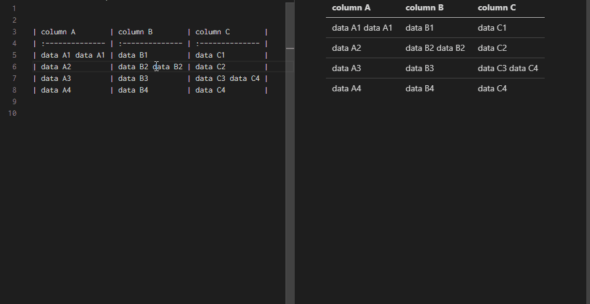
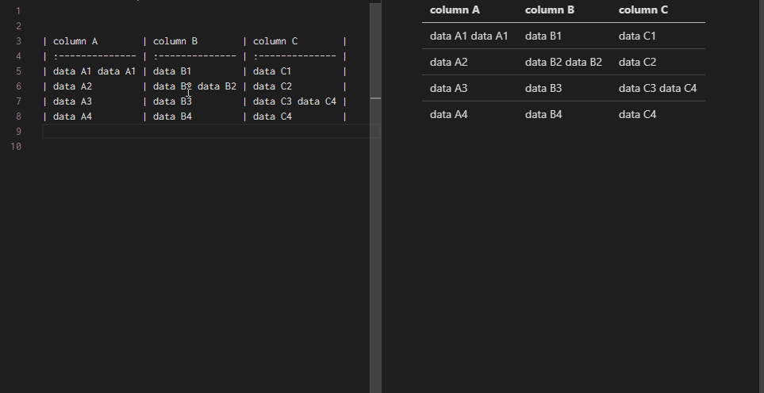
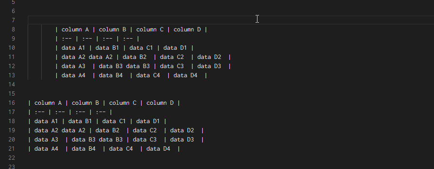
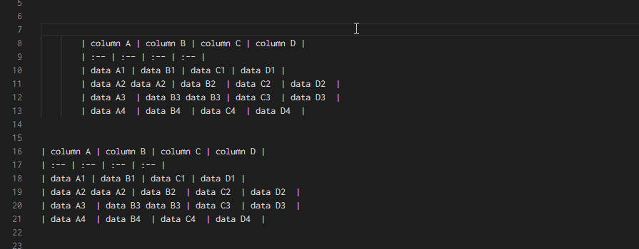
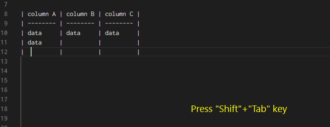

# Change Log

## All notable changes to the "markdowntable" extension will be documented in this file

### 0.11.0

- [Change] VSCode engine to 1.80.0
- [Change] Ignore tables in codeblock
- [Add] Configuration to switch ignore or not ignore tables in codeblock
- [Add] Configurations to hide menu items in right click menu
- [Add] Convert CSV to table command

### 0.10.4 and 0.10.3-PreRelease  (2023/3/15)

- [Add] Extention Icon
- [Add] Quarto support (.qmd)
- [Change] Vscode engine up to 1.63.0

### 0.10.2 (2022/9/5)

- [Change] Reduce requirement for insert commands
    - Allow selecting range

### 0.10.1 (2022/8/10)

- [Change] Remove key binding `Shift+Alt+F` (for markdowntable.format)
- [Change] Remove key binding `Shift+Alt+T` (for markdowntable.tsvToTable)

### 0.10.0 (2022/7/9)

- [Change] Select all text in cell when "Tab" or "Shift+Tab" navigation (fix #48)

### 0.9.2 (2022/4/13)

- [Fix] Add notice in readme (fix #43)
- [Fix] Update packages
- [Fix] Add null check (fix #44)

### 0.9.1 (2022/3/14)

- [Fix] Bug: Status message for debug is found out in status bar

### 0.9.0 (2022/3/11)

- [Update] Added contributor section in readme
- [Fix] Shorten the way to get text in cursor line
- [Fix] Added context key to context menu
    - Hidding context menu when the cursor is not in table region

### 0.8.0 (2022/1/25)

- [Fix] Rearranged the order of escape judgment and inline code judgment (fix #36)
- [Fix] Add custom context key for nextCell/prevCell command's key binding
    - To improve "when" assign of commands to be more suitable.
    - To resolve Tab key confliction with other extensions.
- [Fix] When nextCell/prevCell is called in 2nd row of table, cursol doesn't go next/prev cell correctoly.

### 0.7.2 (2021/12/06)

- [Fix] Navigation slippage while a escaped or inline-coded pipe character is in table.

### 0.7.1 (2021/12/05)

- [Fix] Allow inline code `\` and escaped \\\| in table.
- [Change] Shorten config title. "Markdown Table Configuration" -> "Markdown Table"
- [Fix] Improve processing, don't get the full text.
- [Fix] Update npm packages.

### 0.7.0 (2021/09/11)

- [Add] Add tips for snippet suggestion to generate simple table

### 0.6.0 (2021/06/15)

- [Add] Support mdx
- [Fix] Activate earlier (Activate extension on markdown file is openning)

### 0.5.2 (2021/05/04)

- [Fix] zenkaku handling

### 0.5.1 (2021/03/19)

- [Fix] Readme only
    - Default value of configuration

### 0.5.0 (2021/03/19)

- [Add]
    - Align data and column header when formatting table
        - It can be disabled by configuration

### 0.4.2 (2021/01/13)

- [Fix]
    - Change supported vscode version to "upper than 1.40.0" from "upper than 1.50.0"

### 0.4.1 (2020/11/05)

- Readme update only

### 0.4.0 (2020/11/05)

- [Add] Navigate next/prev cell without auto format command.
- [Fix] Typo: "Insert Row" command should be "Insert Column".

### 0.3.0 (2020/10/27)

- [Add] Align column/columns commands
    - Align column to left/center/right.
    - 
    - Align selected multi columns at once.
    - 

### 0.2.2 (2020/9/5)

- [Fix]
    - Tab key confliction with accepting suggestion or snippet.

### 0.2.1 (2020/9/2)

- [Fix] bugs of navigate to next/prev cell
    - Bahavior when Tab key pressing out of table.
    - Bahavior when Shift+Tab key pressing out of table.

### 0.2.0 (2020/9/1)

- [Fix] Keep white spaces indentation on the left of table when formatting.
    - before
    - 
    - after
    - 

- [Add] Navigate to prev cell when you press Shift+Tab key in table.
    - 

### 0.1.1 (2020/08/07)

- [Fix] Treat "umlauts" as half-width character.

### 0.1.0 (2020/08/01)

- [Add] Navigate to next cell when you press Tab key in table.

### 0.0.2 (2020/07/23)

- Initial release
