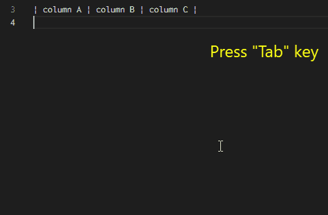
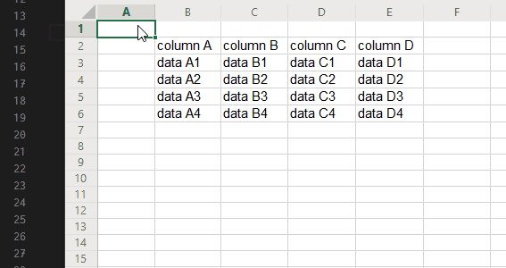
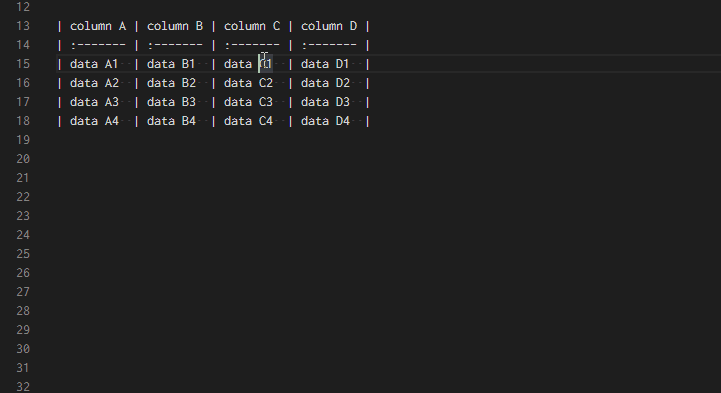

# Markdown Table

Markdown table features (convert from TSV, insert column, format table column width).

## 1. Features

- Navigate to next cell
- Convert to table from TSV text
- Format all tables
- Insert column in the right
- Insert column in the left

## 2. Demo

### 2.1. Navigate to next cell (with auto insert row)

- **Auto navigate to next cell when you press tab key in table.**
- **Auto insert new row, when the cursor is in last row in table.**
- with auto format

Key binding to `Tab`.

### 2.2. Convert to table from TSV text

**Tips: This feature is supposed to make table from excel cells.**

Key binding to `Shift + Alt + T`.

### 2.3. Format table

- **Auto format column width of all tables in current document**

Key binding to `Shift + Alt + F`.

### 2.4. Insert column

## 3. Extension Settings

This extension has no settings.

## 4. Release Notes

### 0.1.0

- Add
    - Navigate to next cell when you press Tab key in table.

## 5. Links

- [Source Code](https://github.com/takumisoft68/vscode-markdown-table)
- [Marketplace](https://marketplace.visualstudio.com/items?itemName=TakumiI.markdowntable)
